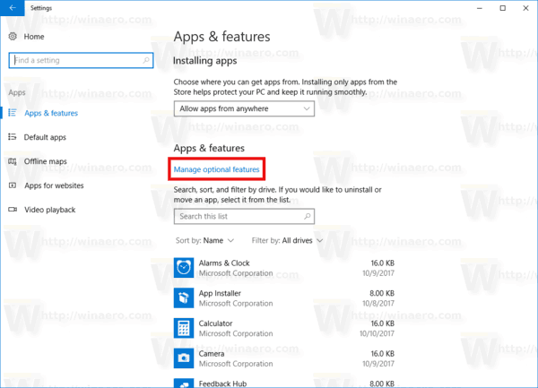
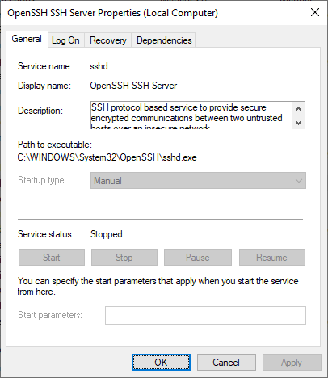
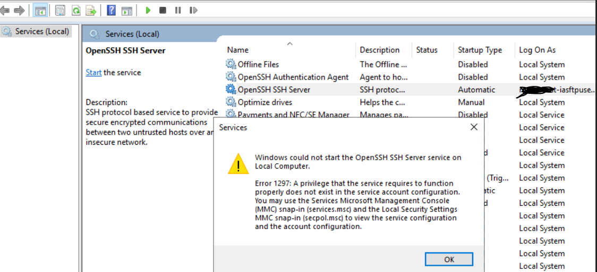

This guide outlines the process for connecting to a Windows Home edition machine via SSH from a mobile device using Termius. Remote Desktop Protocol (RDP) and Windows Pro edition are not required for this setup, as it leverages the OpenSSH Server.

## Compatibility Overview: Windows Home for SSH Access

| Feature                 | Requirement     | Windows Home Compatibility |
| ----------------------- | --------------- | -------------------------- |
| Remote Desktop (RDP)    | Not Required    | No                         |
| SSH Server              | Required        | Yes                        |
| Tailscale / Local Wi-Fi | Required        | Yes                        |
| Termius (mobile)        | Required        | Yes                        |

This guide focuses on utilizing OpenSSH Server for remote access.

--- 

## Step 1: Install OpenSSH Server on Windows (Home)

1. Open **Settings**.
2. Navigate to **Apps → Optional features**.



3. Click **Add a feature**.
4. Locate **OpenSSH Server**.
5. Click **Install**.


Allow the installation to complete.

--- 

## Step 2: Configure and Start OpenSSH Service

1. Press **Win + R**, type `services.msc`, and press Enter.
2. Locate **OpenSSH SSH Server** in the services list.
3. Double-click the service to open its properties.
4. Set the `Startup type` to `Automatic`.



5. Click **Start** to initiate the service.
6. Click **OK** to apply the changes.

--- 

## Step 3: Configure Windows Firewall for SSH Access

1. Open **Windows Security**.
2. Navigate to **Firewall & network protection**.
3. Click **Allow an app through firewall**.



4. Verify that **OpenSSH Server** is permitted for both `Private` and `Public` networks.
   If OpenSSH Server is not listed, click **Allow another app** and add the executable path:

```
C:\Windows\System32\OpenSSH\sshd.exe
```

--- 

## Step 4: Identify Windows Username

Open **Command Prompt** and execute the following command:

```
whoami
```

Example output:

```
desktop-abc123\manoj
```

Your username will be the portion after the backslash (e.g., `manoj` in the example above).

--- 

## Step 5: Determine Windows Local IP Address

In **Command Prompt**, execute:

```
ipconfig
```

Locate the `IPv4 Address` entry, for example:

```
IPv4 Address . . . . : 192.168.1.10
```

Note this IP address for later use.

--- 

## Step 6: (Optional) Integrating Tailscale for External Access

For accessing your Windows machine from outside your local Wi-Fi network, consider installing Tailscale on both your Windows PC and mobile phone. This allows you to use Tailscale's assigned IP or MagicDNS for connection instead of the local IP address.

This step can be omitted if remote access is only required within your local Wi-Fi network.

--- 

## Step 7: Configure Termius Mobile Application

Open the **Termius** mobile application and select to add a new host.

Configure the connection settings as follows:

```
Protocol: SSH
Host: 192.168.1.10   (or Tailscale IP, if applicable)
Port: 22
Username: [Your Windows account name, e.g., manoj]
Password: [Your Windows login password]
```

Note: The password required is your Windows lock-screen password, not your Microsoft account email password.

--- 

## Step 8: Establish Connection

1. Tap **Connect** within the Termius application.
2. Accept the server's fingerprint if prompted.
3. A successful connection will display a prompt similar to:

```
manoj @DESKTOP-ABC123 C:\Users\manoj>
```

You are now successfully connected via SSH.

--- 

## Common Errors and Troubleshooting

### Connection Refused

*   Ensure the OpenSSH Server is running.
*   Review **Step 2** for service configuration.

### Permission Denied

*   Verify the correct username is entered.
*   Use only the account name (e.g., `manoj`), not the domain-qualified name (e.g., `DESKTOP\name`).

### Connection Timeout

*   Confirm both your mobile device and PC are on the same Wi-Fi network.
*   Verify firewall settings allow SSH access as detailed in **Step 3**.

--- 

## Quick Summary

| Item            | Value                  |
| --------------- | ---------------------- |
| Windows edition | Home                   |
| SSH server      | OpenSSH Server         |
| Port            | 22                     |
| Username        | Windows account name   |
| Password        | Windows login password |
| RDP needed      | No                     |